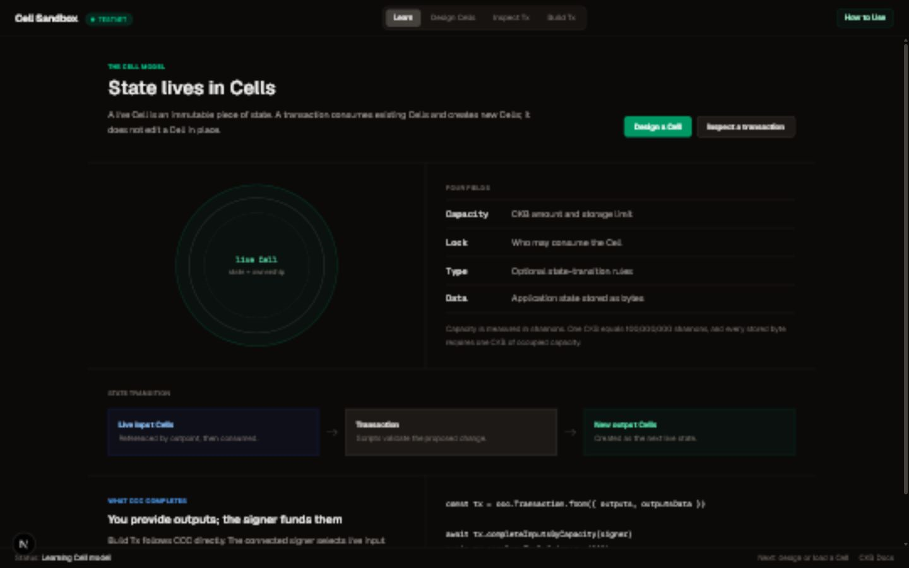
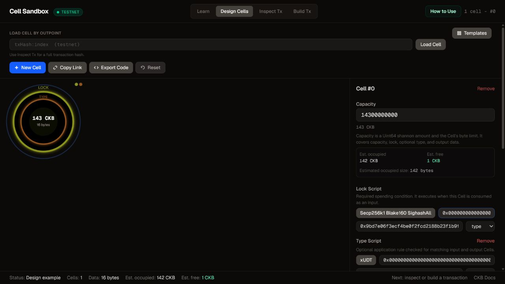
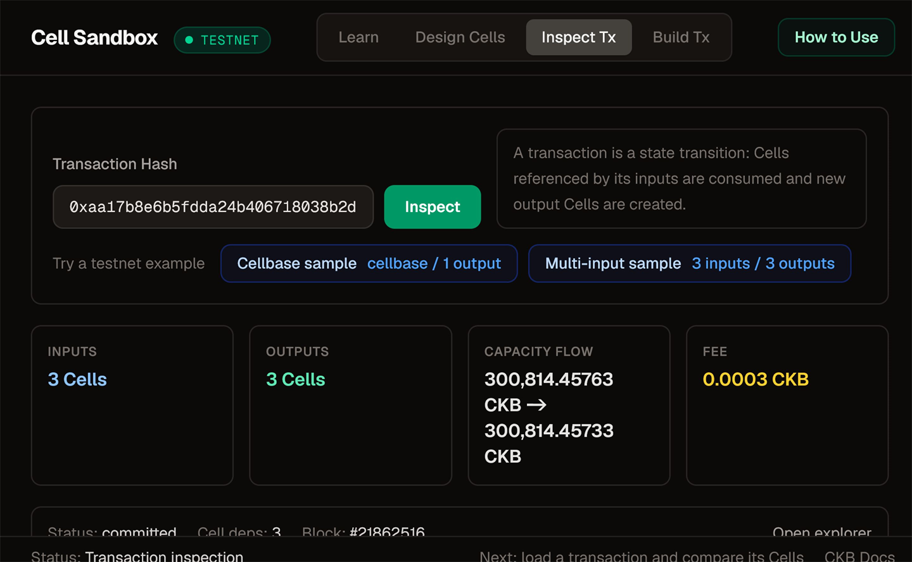
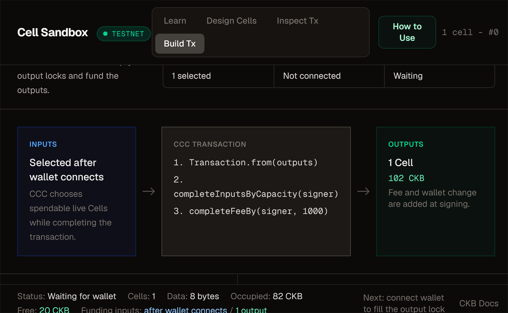

# Cell Sandbox

Cell Sandbox is a visual learning and prototyping workspace for the Nervos CKB Cell model. Design Cells field by field, inspect committed transactions, understand capacity and scripts, export CCC-compatible TypeScript, and build supported transactions without starting from raw structures.

[Open the live demo](https://cell-sandbox-m.vercel.app/) | [Read the CKB docs](https://docs.nervos.org/) | [Architecture](docs/ARCHITECTURE.md) | [Development guide](docs/DEVELOPMENT.md) | [Usability protocol](docs/USABILITY_TESTING.md)



## Why Cell Sandbox

CKB stores state in Cells rather than account records. That model is powerful, but the relationship between capacity, scripts, data, inputs, outputs, and wallet funding can be difficult to see when learning only from serialized transactions.

Cell Sandbox makes those relationships visible:

- **Learn before editing.** Learn is read-only and introduces one concept at a time before raw fields appear in Design Cells.
- **Design with immediate feedback.** See exact capacity, occupied bytes, free capacity, script roles, and decoded data.
- **Inspect real state transitions.** Resolve the previous Cells referenced by transaction inputs and compare them with newly created output Cells.
- **Build with explicit boundaries.** Build hides raw fields, shows the CCC completion path, and leaves editing in Design Cells.
- **Move back to code.** Export the visual configuration as CCC-compatible TypeScript or share it by URL.

## Guided Workflow

| Step | Workspace | What happens |
| --- | --- | --- |
| 1 | **Learn** | Understand capacity, the required lock script, the optional type script, and output data. |
| 2 | **Design Cells** | Create a draft, apply a template, edit fields, or load an on-chain Cell by outpoint. |
| 3 | **Inspect Tx** | Paste a full transaction hash and compare referenced previous Cells with new output Cells. |
| 4 | **Build Tx** | Mark drafts as outputs, connect a wallet, review validation, then sign and broadcast. |

### Design Cells

The designer keeps protocol details next to the field they affect. Known lock and type scripts are separated, capacities remain exact `BigInt` values, and common data formats receive structured previews. Deployment values come from CCC `KnownScript`; occupied size and free capacity come from CCC `CellAny`.



### Inspect Transactions

The inspector resolves regular inputs to their previous Cells, identifies cellbase inputs, handles DAO capacity exceptions, and displays exact capacity flow for ordinary transactions.



Built-in Pudge samples make the view reproducible:

| Sample | Expected result | Transaction hash |
| --- | --- | --- |
| Cellbase | Special null outpoint, 1 output, no ordinary fee | `0xcfad00f9954110b0fc28f850c8c8b7bc7191fd276bdcb43ba1fbff3d8f3b1507` |
| Multi-input | 3 resolved inputs, 3 outputs, exact fee | `0xaa17b8e6b5fdda24b406718038b2ddeabeafc5989fff24bf9679ff7b3a5012c6` |

### Build Transactions

Draft Cells do not become transaction inputs. In Build Tx you explicitly select the Cells to create as outputs. The wallet then selects spendable funding Cells, calculates the fee at signing time, and sends change back to the wallet.



## Current Build Scope

Cell Sandbox intentionally distinguishes sendable templates from design-only examples.

| Template | Availability | Purpose |
| --- | --- | --- |
| CKB Transfer | Build and send | Create a standard output with a wallet or recipient lock. |
| DAO Deposit | Build and send | Create a fresh deposit with exactly 8 zero data bytes and the required DAO cell dep. |
| xUDT Token | Design only | Inspect the raw `uint128` little-endian amount and owner lock hash. |
| Omnilock Cell | Design only | Explore an Ethereum-auth Omnilock configuration. |
| Always Success | Design only | Study an anyone-can-spend testing lock without funding it. |

Build validation blocks unsupported type scripts, malformed script arguments, insufficient capacity, and unsafe testing locks before wallet signing.

## Wallet and Network Support

- CCC wallet selector with JoyID, MetaMask, OKX Wallet, UniSat, UTXO Global, and compatible discovered wallets
- Pudge testnet faucet requests
- Wallet-selected funding Cells, fee completion, signing, and broadcasting
- Pudge testnet and mainnet network modes
- Explorer links for submitted and inspected transactions

Use testnet while learning or validating a template. Mainnet transactions use real CKB and should be reviewed carefully in both Cell Sandbox and the wallet.

## Quick Start

```bash
git clone https://github.com/zynorr/cell-sandbox.git
cd cell-sandbox
pnpm install
pnpm dev
```

Open [http://localhost:3000](http://localhost:3000).

If pnpm asks to approve native builds, run:

```bash
pnpm approve-builds --all
pnpm install
```

## Five-Minute Review

1. Start on **Learn** and follow the Cell to transaction state transition.
2. Open **Design Cells**, choose **Templates**, and inspect the xUDT example.
3. Open **Inspect Tx** and load the built-in multi-input sample.
4. Open **Build Tx**, choose the **CKB Transfer** or **DAO Deposit** template, and confirm it becomes an output.
5. Connect a testnet wallet to see its lock fill the template and the transaction advance to review.

## CKB Model Used in the UI

| Concept | Meaning in Cell Sandbox |
| --- | --- |
| Cell | CKB's base structure for storing state. A transaction consumes live Cells and creates new output Cells. |
| Capacity | A `Uint64` shannon amount representing both CKByte value and the byte budget for the complete Cell. |
| Lock script | Required spending condition executed when a Cell is consumed as an input. |
| Type script | Optional application rule checked across matching input and output Cells. |
| Output data | Application bytes stored in `outputs_data` at the same index as the corresponding output. |
| Address | An encoding of a lock script, not an account or a Cell balance. |
| Fee | For an ordinary transaction, total input capacity minus total output capacity. Cellbase and DAO withdrawal are exceptions. |

Protocol references:

- [Cell](https://docs.nervos.org/docs/tech-explanation/cell) and [Capacity](https://docs.nervos.org/docs/tech-explanation/capacity)
- [Scripts](https://docs.nervos.org/docs/tech-explanation/script), [Inputs](https://docs.nervos.org/docs/tech-explanation/inputs), and [Outputs Data](https://docs.nervos.org/docs/tech-explanation/outputs-data)
- [Transaction RFC 0022](https://github.com/nervosnetwork/rfcs/blob/master/rfcs/0022-transaction-structure/0022-transaction-structure.md)
- [Nervos DAO RFC 0023](https://github.com/nervosnetwork/rfcs/blob/master/rfcs/0023-dao-deposit-withdraw/0023-dao-deposit-withdraw.md)
- [xUDT RFC 0052](https://github.com/nervosnetwork/rfcs/blob/master/rfcs/0052-extensible-udt/0052-extensible-udt.md)

## Tech Stack

| Layer | Technology |
| --- | --- |
| Application | Next.js 16, React 19, TypeScript |
| Styling | Tailwind CSS 4 |
| State | Zustand |
| Transaction flow | Responsive React components |
| CKB SDK and wallets | CCC / `@ckb-ccc` |
| Validation | Zod |
| Tests | Vitest and Testing Library |

## Project Structure

```text
src/
  app/                    Next.js shell and faucet API route
  components/             Designer, inspector, builder, wallet, and guides
  lib/                    CKB clients, validation, templates, and code export
  store/                  Zustand slices and store composition
  types/                  Shared TypeScript types
docs/
  screenshots/            Current product screenshots
  ARCHITECTURE.md          Data flow and design decisions
  DEVELOPMENT.md           Setup, workflow, and troubleshooting
```

## Development Commands

| Command | Purpose |
| --- | --- |
| `pnpm dev` | Start the development server. |
| `pnpm lint` | Run ESLint. |
| `pnpm test` | Run the Vitest suite once. |
| `pnpm test:watch` | Run Vitest in watch mode. |
| `pnpm build` | Create a production build and run Next.js type validation. |
| `pnpm start` | Serve the production build. |

Run the full local verification set with:

```bash
pnpm exec tsc --noEmit
pnpm lint
pnpm test
pnpm build
```

These checks verify implementation behavior. Newcomer comprehension is evaluated separately with the [usability protocol](docs/USABILITY_TESTING.md); no participant results are claimed until sessions are recorded.

## License

MIT. See [LICENSE](LICENSE).
