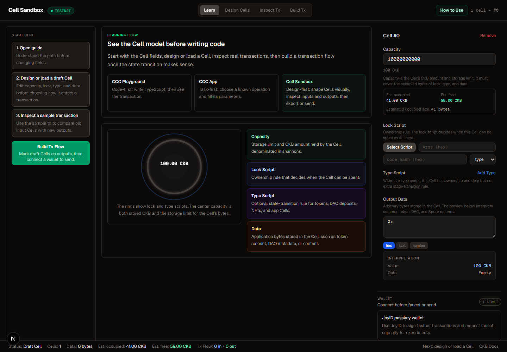
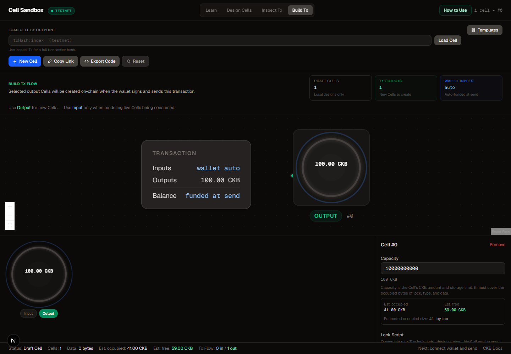
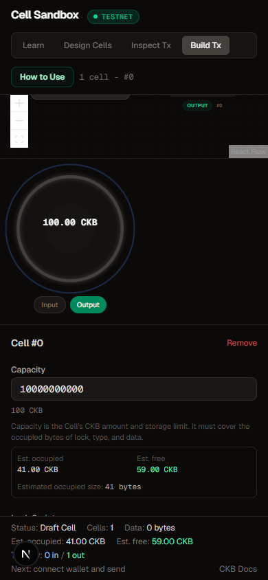

# Cell Sandbox

Cell Sandbox is a visual learning and prototyping workspace for the Nervos CKB Cell model. It helps developers understand how Cells store state, how transactions consume Cells and create new output Cells, and how a visual configuration maps back to CCC-compatible TypeScript.

Live Demo: https://cell-sandbox-m.vercel.app/

## CKB Vocabulary Used

The UI copy and protocol previews follow the official CKB docs and protocol specifications:

- A Cell is the base structure for storing state on CKB.
- Capacity is a Uint64 shannon amount that represents both CKByte value and the byte budget for the complete Cell.
- A lock script is required and runs when the Cell is consumed as an input.
- A type script is optional and checks application rules across matching inputs and outputs.
- A valid transaction can consume only live Cells. After a committed transaction consumes one, that Cell is dead and cannot be reused.
- A CKB address encodes a lock script; it is not an account or a Cell balance.
- For an ordinary transaction, the fee is total input capacity minus total output capacity. Cellbase and DAO withdrawal are protocol exceptions.
- xUDT stores its raw uint128 little-endian amount in the first 16 data bytes; display decimals are application metadata.
- A fresh Nervos DAO deposit uses exactly 8 zero data bytes. Withdrawal is a separate two-phase flow.

Primary references: [Cell](https://docs.nervos.org/docs/tech-explanation/cell), [Capacity](https://docs.nervos.org/docs/tech-explanation/capacity), [Script](https://docs.nervos.org/docs/tech-explanation/script), [Transaction](https://docs.nervos.org/docs/tech-explanation/transaction), [Transaction RFC 0022](https://github.com/nervosnetwork/rfcs/blob/master/rfcs/0022-transaction-structure/0022-transaction-structure.md), [Inputs](https://docs.nervos.org/docs/tech-explanation/inputs), [Outputs Data](https://docs.nervos.org/docs/tech-explanation/outputs-data), [Address](https://docs.nervos.org/docs/ckb-fundamentals/ckb-address), [DAO RFC 0023](https://github.com/nervosnetwork/rfcs/blob/master/rfcs/0023-dao-deposit-withdraw/0023-dao-deposit-withdraw.md), [xUDT RFC 0052](https://github.com/nervosnetwork/rfcs/blob/master/rfcs/0052-extensible-udt/0052-extensible-udt.md), and [Spore data](https://docs.spore.pro/recipes/Data/handle-spore-data).

## Milestone 1 Learning Flow

The app is organized around four workspace modes:

| Mode | Purpose |
| --- | --- |
| Learn | Start with the Cell mental model: capacity, lock script, type script, and data. |
| Design Cells | Create a draft Cell, use templates, or load one on-chain Cell by outpoint. |
| Inspect Tx | Paste a full transaction hash and compare referenced input Cells with the new output Cells it creates. |
| Build Tx | Mark draft Cells as outputs to create, then let the wallet supply funding inputs when sending. |

The interface includes:

- A visible How to Use guide
- A Start Here panel for first-time users
- Inline explanations beside technical Cell fields
- Clearer empty, loading, partial, and error states
- A transaction inspector that separates consumed input Cells from new output Cells
- A bottom status strip showing the active state and next useful action

## Screenshots

| Learn / Start | Build Tx Output | Mobile Build Tx |
| --- | --- | --- |
|  |  |  |

## Features

### Visual Cell Designer

- Edit capacity in shannons with a CKB preview and occupied/free estimates
- Choose known lock and type scripts or paste custom script fields
- Edit data in hex, text, or number modes
- Preview exact xUDT amounts, DAO state data, and Molecule-encoded Spore content

### Cell Templates

Pre-built Cell configurations cover common CKB patterns:

| Template | Mode | Description |
| --- | --- | --- |
| CKB Transfer | Build | Create a standard 62 CKB output with a wallet or recipient lock |
| DAO Deposit | Build | Create a fresh deposit with the required 8 zero data bytes |
| xUDT Token | Design only | Explore the raw uint128 LE amount and owner-lock-hash placeholder |
| Spore v2 Cell | Design only | Inspect Molecule-encoded content and sample IDs |
| Omnilock Cell | Design only | Inspect an Ethereum-auth Omnilock example |
| Always Success | Design only | Inspect an anyone-can-spend testing lock without funding it |

### Transaction Inspection

The Inspect Tx workspace loads a transaction by hash and shows:

- Transaction status and block number
- Transaction inputs and referenced previous Cells
- New output Cells created
- Capacity flow and ordinary transaction fees when all inputs resolve, with cellbase and DAO exceptions identified
- Cell dep count
- Explorer link for verification
- Partial input resolution when public RPC data is incomplete

Two committed Pudge transactions are built in for reproducible review:

| Example | Expected result | Transaction hash |
| --- | --- | --- |
| Cellbase sample | 1 special input / 1 output | `0xcfad00f9954110b0fc28f850c8c8b7bc7191fd276bdcb43ba1fbff3d8f3b1507` |
| Multi-input sample | 3 inputs / 3 outputs | `0xaa17b8e6b5fdda24b406718038b2ddeabeafc5989fff24bf9679ff7b3a5012c6` |

### Transaction Flow Builder

The Build Tx workspace uses React Flow to show a transaction as a state transition:

- Mark local draft Cells as output Cells to create
- Apply a Build template to replace the workspace and create its outputs immediately
- Represent wallet-owned funding Cells as an automatic source instead of selectable drafts
- Calculate fees and return change through the connected wallet at signing time
- Block design-only type scripts and unsafe testing locks before wallet signing

### Wallet and On-Chain Actions

- CCC wallet selector with JoyID and discovered compatible wallets
- Testnet faucet request
- Transaction signing and broadcasting
- Network switch between Pudge testnet and mainnet
- On-chain Cell loading by outpoint

### Export and Share

- Copy CCC-compatible TypeScript code
- Copy shareable URLs for Cell configurations
- Restore shared Cell state from URL parameters

## Quick Start

```bash
pnpm install
pnpm dev
```

Open http://localhost:3000.

If pnpm asks about approved native builds, approve the listed packages and run install again:

```bash
pnpm approve-builds --all
pnpm install
```

## Try the Guided Flow

1. Open the app and start in Learn.
2. Click How to Use or follow the Start Here panel.
3. Move to Design Cells and create or load a draft Cell.
4. Move to Build Tx.
5. Click Add output under a designed Cell, or choose a Build template to create an output immediately.
6. Choose a CCC-compatible wallet. Empty template output locks are filled from the selected wallet.
7. Review the output summary, then confirm signing and sending in the wallet.

## Reviewer Walkthrough

From a fresh page load:

| Step | What to check |
| --- | --- |
| Learn | The default workspace explains capacity, lock script, type script, and data before asking for code. |
| Design | The editor describes the selected Cell as a local draft with capacity, a required lock, an optional type rule, and output data. |
| Build Tx | The progress strip separates Cell design, output selection, wallet funding, and final review. |
| Add Output | Clicking Add output shows the new Cell on the right and adds automatic wallet funding on the left. |
| Templates | Build templates become outputs; design-only examples return to Design Cells and clear the transaction flow. |
| Connect / Send | Connecting fills empty template locks, then Review transaction opens validation before wallet signing. |

## How to Verify

Reviewers can verify Milestone 1 locally or in the deployed demo:

| Deliverable | Verification |
| --- | --- |
| Guided learning flow | Open the app and confirm the default workspace starts on Learn with Start Here and How to Use visible. |
| Clear module structure | Confirm the top navigation has Learn, Design Cells, Inspect Tx, and Build Tx. |
| Cell field explanations | Open Design Cells and confirm capacity, lock, type, and data fields include helper explanations. |
| Full transaction inspection | Open Inspect Tx and click Cellbase sample, or paste `0xcfad00f9954110b0fc28f850c8c8b7bc7191fd276bdcb43ba1fbff3d8f3b1507`; confirm its null outpoint is identified as cellbase rather than an unresolved Cell. |
| Multi-input inspection | Click Multi-input sample, or paste `0xaa17b8e6b5fdda24b406718038b2ddeabeafc5989fff24bf9679ff7b3a5012c6`, and confirm the summary shows 3 input Cells and 3 output Cells. |
| Input/output Cell display | Confirm regular inputs show their previous Cells, the cellbase input is marked as special, and every output appears under Output Cells Created. |
| Empty/loading/error states | Try an invalid hash such as `0x1234` and confirm the validation message appears. |
| Capacity education | Confirm the editor and bottom status strip show occupied/free capacity estimates. |
| Responsive layout | Open the app around 390px width and confirm the same Learn / Design / Inspect / Build model remains usable. |

## Project Structure

```text
src/
  app/
    api/faucet/route.ts       Faucet proxy
    globals.css               Global styles
    layout.tsx                Root layout
    page.tsx                  Main workspace shell
  components/
    CellConceptPanel.tsx      Educational Cell model panel
    CellEditor.tsx            Cell property editor
    CellTemplates.tsx         Template browser
    CellView.tsx              SVG Cell visualization
    DataEditor.tsx            Hex/text/number data input
    DataPreview.tsx           Data interpretation panel
    GuidePanel.tsx            How to Use guide
    ScriptSelector.tsx        Known script picker
    StartHerePanel.tsx        First-use learning steps
    Toolbar.tsx               Cell actions and outpoint loader
    TransactionFlow.tsx       React Flow transaction builder
    TransactionInspector.tsx  Full transaction hash inspector
    TxConfirmDialog.tsx       Send confirmation dialog
    WalletConnect.tsx         Wallet, faucet, and send controls
    WorkspaceStatus.tsx       Bottom status and next-step strip
  lib/
    ccc.ts                    CCC client helpers
    cell.ts                   Cell factory, loader, and codegen
    schemas.ts                Zod validation schemas
    script.ts                 Known script registry
    share.ts                  URL serialization
    templates.ts              Cell template definitions
    transaction.ts            Transaction hash loader
  store/
    slices/                   Zustand store slices
    sandbox.ts                Store composition
  types/
    index.ts                  Shared TypeScript types
```

## Tech Stack

| Layer | Technology |
| --- | --- |
| Framework | Next.js 16 App Router |
| Styling | Tailwind CSS v4 |
| State | Zustand |
| Flow Canvas | React Flow / `@xyflow/react` |
| CKB SDK | CCC / `@ckb-ccc/ccc` |
| Wallet | CCC React connector with JoyID and compatible wallet discovery |
| Validation | Zod |
| Testing | Vitest and Testing Library |
| Deployment | Vercel |

## Scripts

| Command | Description |
| --- | --- |
| `pnpm dev` | Start development server |
| `pnpm build` | Production build |
| `pnpm start` | Start production server |
| `pnpm lint` | Run ESLint |
| `pnpm test` | Run Vitest |
| `pnpm test:watch` | Run tests in watch mode |

## Testing

```bash
pnpm test
pnpm lint
pnpm build
```

The existing test suite covers data preview parsing, data editor conversions, schema validation, and share URL serialization.

## Docs

| Document | Description |
| --- | --- |
| `docs/ARCHITECTURE.md` | Data flow, store design, component tree, and design decisions |
| `docs/DEVELOPMENT.md` | Local setup, workflow, testing, and troubleshooting |

See `CONTRIBUTING.md` for contribution details.

## License

MIT. See `LICENSE` for details.
